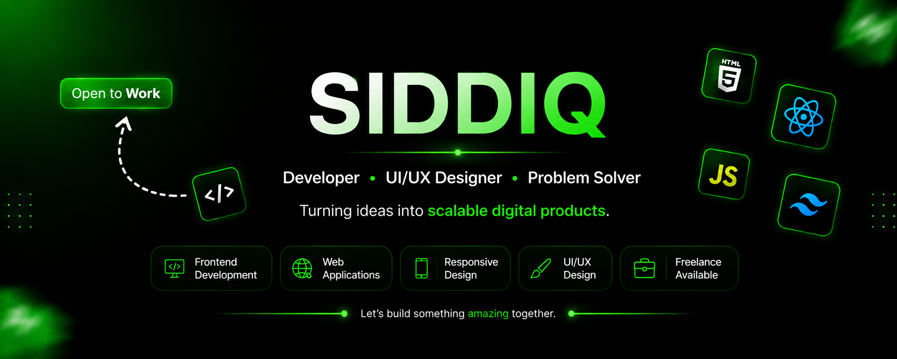

<!--
  GitHub Profile README
  To make this live: create a public repo named EXACTLY your GitHub username
  (e.g. github.com/SidhCodez/SidhCodez), and put this file in it as README.md.
  Replace GITHUB_USERNAME everywhere below with your real GitHub handle.
-->

<p align="center">
  
</p>

### 👋 About Me

```js
const sidy = {
  role: "Frontend Developer & UI/UX Designer",
  location: "Bengaluru, India 🇮🇳",
  studying: "BCA @ St. Claret College (Autonomous)",

  building: [
    "Devora — deadline tracking & client management SaaS",
    "LinkO — cross-device link-saving PWA",
  ],

  agency: "Co-founder @ CloudWork — design, video editing, web dev",

  stack: {
    frontend: [
      "React",
      "Next.js",
      "TypeScript",
      "Tailwind CSS",
      "Framer Motion",
    ],
    backend: ["Node.js", "Supabase", "Firebase"],
    tools: ["Vite", "Vercel", "Netlify", "Notion API"],
  },

  funFact: "Also walks runway shows for my college fashion team 🚶",
};
```

> "Good design is invisible until it's missing."

---

### 🔗 Connect With Me

[](https://www.linkedin.com/in/siddiq-dev)
[](https://instagram.com/vinsmoke.sidy)
[](https://siddiq-portfolio-web.vercel.app)

---

### 🛠️ Tech Stack


---

### 📌 Featured Projects

| Project                              | Description                                                             |
| ------------------------------------ | ----------------------------------------------------------------------- |
| **[DevoraBuilds](https://devora-builds.vercel.app)** | Freelance agency (co-founded) — design, video editing, web development  |
| **LinkO**                            | Cross-device link-saving PWA — vanilla JS + Supabase, realtime sync     |
| **VoiceAI Receptionist**             | (In Production)⚡ Fast Response 📅 Calendar Sync 🤖 Agent API ✅ Task Completion 🏢 Business Testing     |
| **PathForge**                        | Frontend roadmap generator covering 59 domains, with progress tracking  |
| **Resumind**                         | AI resume analyzer built with React 19, TypeScript, Vite, Puter.js      |
| **Mock Interview Platform**          | React app with WebRTC + a heuristic scoring engine                      |

---

### 📊 GitHub Analytics


---

### 🏆 GitHub Trophies


---


